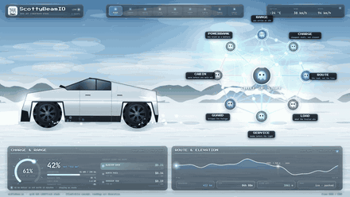

# grokbot-cybertruck
<div align="center">

**Nine Grok Bot agents that turn what your truck already knows into one sentence you can act on.**

No code. No install. Nine prompts you paste into Grok Bot and use today.

[Setup](SETUP.md) · [The agents](agents/) · [Rules](RULES.md) · [Templates](TEMPLATES.md) · [FAQ](FAQ.md)



</div>

---

## Where this came from

This repo is the full build-out of my post:

**→ https://x.com/ScottyBeamIO/status/2093430437704319344**

The post makes the argument. This repo is the thing itself — every agent, every prompt,
ready to paste.

## What it is

Everyone talks about the Cybertruck like it's a design argument. It isn't. It's a
computer with a bed on the back, and almost nobody is treating it like one.

Your truck already shows you everything you need: mass, range, temperature, charge
level, tyre pressure, service reminders, sentry events. What it does with all of it is
*display* it. Nine numbers on a screen, and the job of turning nine numbers into one
decision is left to you, while you're holding a steering wheel.

The gap isn't the data. **It's that nobody decides for you.**

So this is nine Grok Bot agents. Eight of them each own one narrow job. The ninth reads
all eight and says one thing.

```
LOAD → ROUTE → RANGE → CHARGE → CABIN
                                   │
SERVICE  (can veto everything) ────┤
GUARD ─────────────────────────────┤
POWERBANK ─────────────────────────┤
                                   ▼
                        CHIEF OF STAFF
                                   ▼
                            one sentence
```

**Nine reports in. One sentence out.**

> Leave at 14:20, charge 18 minutes at Green River, you arrive with 62 km.

That sentence is the whole product. Everything else exists to make it trustworthy.

## Why Grok Bot

Four reasons this setup fits Grok Bot specifically:

- **Nine agents, no code.** Each agent is a prompt. You create nine bots, paste nine
  prompts, done. Nothing to install, nothing to host, nothing to maintain.
- **They can hand off to each other.** The whole design depends on agent 3 reading
  agent 1's answer. Grok Bot lets you chain that without writing an orchestrator.
- **Live data where it matters.** ROUTE and CHARGE need current conditions — weather on
  the pass, whether a charger is busy. Grok Bot can look that up mid-run.
- **You stay in the loop.** Nothing is automated behind your back. You paste the
  numbers, you read the sentence, you decide.

## The nine agents

| # | Agent | What it does, in one line |
| - | ----- | ------------------------- |
| 01 | [**LOAD**](agents/01-load.md) | Weighs what you're carrying and what it costs you. Everything after this depends on it. |
| 02 | [**ROUTE**](agents/02-route.md) | Draws a road, not a line — gradients, closures, the weather sitting on the pass. |
| 03 | [**RANGE**](agents/03-range.md) | One honest number for the *end* of the drive, not an optimistic one for the start. |
| 04 | [**CHARGE**](agents/04-charge.md) | Asks whether you need a stop **at all**. Only then does it shop for one. |
| 05 | [**CABIN**](agents/05-cabin.md) | Prices comfort in kilometres, so you can see what warmth actually costs. |
| 06 | [**SERVICE**](agents/06-service.md) | Holds a veto over all of it. The only agent whose job is to say no. |
| 07 | [**GUARD**](agents/07-guard.md) | Watches while you're away and compresses hours into the two seconds that mattered. |
| 08 | [**POWERBANK**](agents/08-powerbank.md) | Runs your tools off the truck without borrowing from tomorrow's trip. |
| 09 | [**CHIEF OF STAFF**](agents/09-chief-of-staff.md) | Reads all eight, settles their arguments, writes one sentence. |

Each file has the agent's job, its full setup prompt, what to feed it, what it gives
back, and the mistakes it makes when it goes wrong.

## Quick setup — 10 minutes

Full version in [SETUP.md](SETUP.md). The short version:

**1.** Open Grok Bot and create nine agents. Name them exactly: `LOAD`, `ROUTE`,
`RANGE`, `CHARGE`, `CABIN`, `SERVICE`, `GUARD`, `POWERBANK`, `CHIEF OF STAFF`.

**2.** Open each file in [`agents/`](agents/), copy the block under **Setup prompt**,
paste it into that agent. Copy it exactly — the rules that look redundant are the ones
that were added after something went wrong.

**3.** Paste the shared rules from [RULES.md](RULES.md) into all nine, above their own
prompt. Nine agents that don't share a rulebook drift apart within a week.

**4.** Fill in the trip template from [TEMPLATES.md](TEMPLATES.md) — it's the numbers
off your own screen, takes about a minute.

**5.** Run them in order, feeding each one the previous answers. Give all eight answers
to CHIEF OF STAFF last.

**In a hurry?** [TEMPLATES.md](TEMPLATES.md) has a **one-shot version** — a single
prompt that plays all nine in sequence in one chat. Weaker than the real chain, but
it's two minutes and you'll see the shape immediately.

## The rules that make it work

Three things carry most of the value. Break any of them and you have nine chatbots
instead of a system. Long version in [RULES.md](RULES.md).

**1 · Order is not a suggestion.** RANGE without LOAD's number is a guess. CHARGE
without RANGE's number is a guess with a receipt. Run them in the order above, always,
and give each one the answers it asks for — no more.

**2 · One agent holds the veto, and it isn't the boss.** SERVICE can stop the trip.
CHIEF OF STAFF cannot overrule it. An agent that wants your trip to go well should
never be the one deciding whether it's safe — it will find a reason the worn tyre is
fine.

**3 · The ninth agent decides, it doesn't summarise.** If CHIEF OF STAFF hands you
eight findings, it failed. You already had nine numbers on a screen; a longer list is
worse, not better. Its job is to pick a winner and say one thing.

## What good output looks like

Right:

> **Leave at 14:20, charge 18 minutes at Green River, you arrive with 62 km.**

Wrong:

> LOAD reports 5,389 kg, ROUTE suggests the valley road, RANGE expects 18% at
> arrival, CHARGE recommends a stop…

Both contain the same facts. Only one of them is a decision. If you're getting the
second one, [RULES.md](RULES.md) has the fix.

## Honest details

**It doesn't plug into your truck.** There's no app, no API, no login. You paste the
numbers your own screen is already showing you — that's what the template in
[TEMPLATES.md](TEMPLATES.md) is for. Takes a minute, and it means this works today
regardless of what car you drive.

**Every number it gives you is an estimate.** Nine agents reasoning over what you typed
in. Better reasoning than one prompt, and still an estimate. Check it against your
truck's own display.

**It is not a safety system.** SERVICE's veto is a prompt being careful, not an
inspection. Never use this to decide whether a vehicle is safe to drive, whether a pass
is open, or whether something needs service. Use your instruments, the manufacturer's
guidance, and your own judgement.

**Not affiliated with Tesla or xAI.** Independent project, no logos, no endorsement.
See [NOTICE.md](NOTICE.md).

## What's in here

```
README.md        you are here
SETUP.md         step by step, 10 minutes
RULES.md         the shared rulebook every agent gets
TEMPLATES.md     the trip template, the one-shot prompt, a daily check-in
FAQ.md           what people ask, including "does it really work"
NOTICE.md        no affiliation, no vehicle connection, not a safety device
CONTRIBUTING.md  how to improve an agent
LICENSE          MIT — take it, change it, ship it
agents/          nine agents, nine prompts
```

## Licence

[MIT](LICENSE). Take it, change it, ship your own version.

Built by [@ScottyBeamIO](https://x.com/ScottyBeamIO) 🐹

